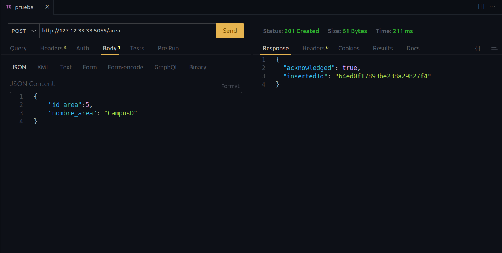
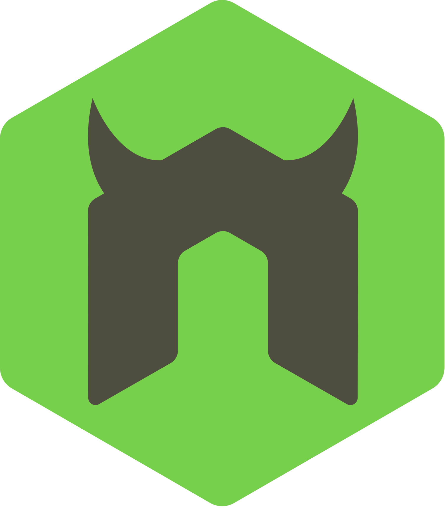

# Incidencias MongoDB

En este Taller estamos Generando una Base de Datos en mongo apartir de una base de datos de Mysql para un sistema de control de incidencias, implementado nuevas tecnologias para optimizar las consultas, que permita a los Trainners reportar problemas de los equipos pertenecientes a salones por zonas


# DATABASE A USAR

Este es el esquema de la base de datos en <span style="color:orange;">MySQL</span> y lo vamos a transalada a <span style="color:green;">MongoDB</span><br><br> 
<br><br>


# DEPENDENCIAS IMPLEMENTADAS

```JSON
        "class-transformer": "0.5.1",
        "class-validator": "0.14.0",
        "cookie-parser": "1.4.6",
        "dotenv": "16.3.1",
        "express": "4.18.2",
        "express-query-boolean": "2.0.0",
        "express-rate-limit": "6.8.1",
        "express-routes-versioning": "^1.0.1",
        "express-session": "1.17.3",
        "express-validator": "7.0.1",
        "jose": "4.14.4",
        "mongodb": "5.7.0",
        "nodemon": "3.0.1",
        "passport": "0.6.0",
        "passport-http-bearer": "1.0.1"
```
<br><br>

# IMPLEMENTACION PROYECTO

### CLONACION DEL REPOSITORIO

Clonamos el repositorio con visual estudio code y lo guardamos en una carpeta de nuestra elección

```
https://github.com/JoseCabrejoVillarCampus/mongoIncidenciasCampus
```
<br><br>

### INSTALACION DE DEPENDENCIAS

Para Usar las Dependencias que estan en el package.json :
```
npm install
```
<br><br>

# CONFIGURACION DEL .env

Dentro de la Ruta que creamos para alojar el proyecto buscamos  el  archivo llamado ".env.example" y lo cambiamos por ".env"
En el archivo .env, configurar las siguientes variables de conexión a la base de datos:
```
MY_SERVER={"hostname":"","port":""}
ATLAS_USER=""
ATLAS_PASSWORD=""
ATLAS_DB=""
JWT_PRIVATE_KEY=""
```
En el campo de MY_SERVER ingrese un hostname y un puerto a su elección(preferiblemente mayor al 5000). Recuerde que por defecto el local host requiere que el hostname es 127.0.0.1. pero puede ser,
ATLAS_USER es el usuario de la base de datos registrado en Atlas y ATLAS_PASSWORD es la contraseña que le asignamos, ATLAS_DB es el nombre de la base de datos y el JWT_PRIVATE_KEY es la palabra secreta que usaremos para generar los tokens de JWT

Hemos Creado un Usuario con acceso a la db de Moongo npara el testeo:

```
MY_SERVER={"hostname":"","port":""}
ATLAS_USER="miguel"
ATLAS_PASSWORD="miguel"
ATLAS_DB="db_incidencias"
JWT_PRIVATE_KEY=""
```

<br><br>

# INICIAR nodemon

```
npm run dev
```
<br><br>

# INSTALACION BASE DE DATOS

Teniendo una cuenta en MongoDB Atlas, ya registrado indicado en la documentacion
https://github.com/JoseCabrejoVillarCampus/mongoDocumentacion

Nos dirigimos la carpeta [db](db), en el archivo  [query.mongodb](db/query.mongodb)
aca observaremos que para crear las coleciones, hemos realizado esquemas para la verificacion de tipo y patrones de datos

<br><br>

Procedemos a ejecutarlo uno por uno, en este caso hemos puesto la creacion de la colecion y la insercion de datos para cada una seguidamente, vasta con seleccionar la coleccion y dar en el boton "RUN" alojado en la esquina derecha superior

<br><br>

Diseño para la insercion de varios Datos para la tabla correspondiente alojasod en [db](db), en el archivo [queryDatos.mongodb](db/queryDatos.mongodb), la ejecutamos de forma igual a la creacion de la coleccion

<br><br>

# INSTALACION COLECCIONES USUARIO Y LOGIN

Ahora nos dirigimos dentro de la misma carpeta [db](db), esta vez en el archivo  [queryUsuario.mongodb](db/queryUsuario.mongodb), en este archivo vamos a crear las colecciones <span style="color:green;">usuario</span> , <span style="color:green;">login</span> , <span style="color:green;">rol</span>,para la validacion por token del portador segun la strategia [http-passport-bearer](https://www.passportjs.org/packages/passport-http-bearer/), en nuestro proyecto [passPortHelper](helpers/passPortHelper.js), ademas de otras peueñas cosas, que simplemente ahi que ejecutar con el boton RUN

## Creación de las Colecciones

<br><br>

## Defininendo los Perimsos por Usuario

<br><br>

## Creacion del Autoincremental

Esta nos permite dar un id autoincremental a cada rol agregado

<br><br>

# GENERACION DE TOKEN DE ACCESO

En esta ocacion, hemos generado un token de acceso unico para cada usuario, basandonos en su esquema, rol y  permisos, este codigo lo podemos observar dentro de la carpeta [helpers](helpers), en el archivo [JWT.js](helpers/JWT.js)

Generar Token de acceso 

- Generación: Una vez dentro del cliente que estemos usando,("En este caso estamos ejecutando en thunderClient"), a traves
del metodo POST

```js
  http://${config.hostname}:${config.port}/login
```

<br><br>

Donde debemos pasarle un body con un nombre que tengamos creado ya en la base de datos, dentro de la coleccion cliente, tambien vemos los permisos para las versiones que este tiene:

```js
  {
    "nombre": "Jhon"
  }
```
```js
  {
    "nombre": "Marcos"
  }
```
<br><br>

En este ejemplo vemos que "Jhon" y "Marcos", tienen permisos diferentes

<br><br>


Este token tiene un limite de tiempo, en ese rango de tiempo podremos acceder a las rutas y endPoints de nuestra Api. Una vez pasada esta hora será necesario generar uno nuevo.<br><br>


# CONSULTAS<br><br>


## FUNCIONAMIENTO Y ENDPOINTS.<br><br>


**CRUD DE LAS COLECCIONES**
Los siguiente endPoints corresponden a los CRUDs de cada coleccion, **es importante recordar que para realizar los metodos devimos generar anteriormente el token de usuario y tener los permisos, en este caso Accept-Version de las rutas**.
Para estos endPoints se pueden realizar las consultas básicas, get, get by id, post, put y delete.  <br><br>

* EndPoint CRUD de la Tabla db_incidencias:
Estos funciona  para POST/ GET/ DELETE/ PUT/,dentro del cliente que deseemos usar<br><br>

* EndPoint CRUD de la Tabla area: 
```js
  http://${config.hostname}:${config.port}/area
```
<br><br> 

* EndPoint CRUD de la Tabla categoria: 
```js
  http://${config.hostname}:${config.port}/categoria
```
<br><br>

* EndPoint CRUD de la Tabla diadema:
```js
  http://${config.hostname}:${config.port}/diadema
```
<br><br>

* EndPoint CRUD de la Tabla email: 
```js
  http://${config.hostname}:${config.port}/email
```
<br><br>

* EndPoint CRUD de la Tabla equipo:
```js
  http://${config.hostname}:${config.port}/equipo
```
<br><br>

* EndPoint CRUD de la Tabla estado: 
```js
  http://${config.hostname}:${config.port}/estado
```
<br><br>

* EndPoint CRUD de la Tabla incidencia: 
```js
  http://${config.hostname}:${config.port}/incidencia
```
<br><br>

* EndPoint CRUD de la Tabla mouse:
```js
  http://${config.hostname}:${config.port}/mouse
```
<br><br>

* EndPoint CRUD de la Tabla pantalla: 
```js
  http://${config.hostname}:${config.port}/pantalla
```
<br><br>

* EndPoint CRUD de la Tabla reporte: 
```js
  http://${config.hostname}:${config.port}/reporte
```
<br><br>

* EndPoint CRUD de la Tabla salonTrainner: 
```js
  http://${config.hostname}:${config.port}/salonTrainner
```
<br><br>

* EndPoint CRUD de la Tabla salon: 
```js
  http://${config.hostname}:${config.port}/salon
```
<br><br>

* EndPoint CRUD de la Tabla teclado: 
```js
  http://${config.hostname}:${config.port}/teclado
```
<br><br>

* EndPoint CRUD de la Tabla telefono: 
```js
  http://${config.hostname}:${config.port}/telefono
```
<br><br>

* EndPoint CRUD de la Tabla tipoIncidencia: 
```js
  http://${config.hostname}:${config.port}/tipoIncidencia
```
<br><br>

* EndPoint CRUD de la Tabla torre: 
```js
  http://${config.hostname}:${config.port}/torre
```
<br><br>

* EndPoint CRUD de la Tabla trainner: 
```js
  http://${config.hostname}:${config.port}/trainner
```
<br><br>


<span style="color:green;">Adicional ahora debemos enviar en los Headers, la version y el token</span><br><br>

<span style="color:blue;">EJEMPLO:</span><br><br>

<br><br>

Ahora, las versiones disponibles para los Crud normales son

```js
  version:[1.0.0]
```
<br><br>

## Metodo GET BY ID para todas las colecciones

El metodo **GET BY ID** para todas las tablas es el mismo del endpoint,pero si deseamos buscar por ID, si cambia algo la ruta, ya que nos es necesario adicionar un "/" seguido del id que desamos buscar

<span style="color:blue;">EJEMPLO:</span>

```js
  http://${config.hostname}:${config.port}/area?id=2
```

Validador  en Ejecucion:


En este caso estamos buscando dentro de la coleccion area, el id especifico 2, que corresponde a nuestro "id_area", creado en los esquemeas

<br>


pero aca es necesario ajustar la version

```js
  version:[1.0.1]
```


## Metodo POST para todas las colecciones

El metodo **POST** funciona igual en todas las colecciones, en la misma url del metodo get. 
El body es donde vamos a hacer la insersion de datos y contiene los campos de la coleccion, para cada coleccion el body 
varia.

```js
  version:[1.0.0]
```

<span style="color:blue;">EJEMPLO:</span>

<br><br>

Validador  en Ejecucion:


## Metodo PUT para todas las colecciones

El metodo put funciona igual en todas las colecciones, en la misma url del metodo colecciones?id=,
este parametro id dentro del body se omite. 
El body es donde vamos a hacer la insersion de datos y contiene los campos de la coleccion, para cada coleccion el body 
varia.

```js
  http://${config.hostname}:${config.port}/area?id=2
```

```js
  version:[1.0.0]
```

<span style="color:blue;">EJEMPLO:</span>


Validador  en Ejecucion:


### BODY PARA LAS COLECCIONES METODO POST Y PUT:

<span style="color:blue;">Para Incidencia (incidencia)</span>

```js
  {
    "id_incidencia": 0,
    "categoria_incidencia": 0,
    "tipo_incidencia": 0,
    "descripcion_incidencia": "",
    "fecha_incidencia": 0,
    "equipo_incidencia": 0,
    "lugar_incidencia": 0,
    "trainner_reporta_incidencia": 0
  }
```

<span style="color:blue;">Para Equipo (equipo)</span>

```js
  {
    "id_equipo": 0,
    "pantalla_equipo": 0,
    "torre_equipo": 0,
    "teclado_equipo": 0,
    "mouse_equipo": 0,
    "diadema_equipo": 0,
    "salon_equipo": 0
  }
```

<span style="color:blue;">Para Diadema (diadema)</span>

```js
  {
    "id_diadema": 0,
    "marca_diadema": "",
    "color_diadema": "",
    "estado_diadema": 0
  }
```

<span style="color:blue;">Para Mouse (mouse)</span>

```js
  {
    "id_mouse": 0,
    "marca_mouse": "",
    "color_mouse": "",
    "estado_mouse": 0
  }
```

<span style="color:blue;">Para Teclado (teclado)</span>

```js
  {
    "id_teclado": 0,
    "marca_teclado": "",
    "color_teclado": "",
    "estado_teclado": 0
  }
```

<span style="color:blue;">Para Torre (torre)</span>

```js
  {
    "id_torre": 0,
    "marca_torre": "",
    "color_torre": "",
    "estado_torre": 0
  }
```

<span style="color:blue;">Para Pantalla (pantalla)</span>

```js
  {
    "id_pantalla": 0,
    "marca_pantalla": "",
    "color_pantalla": "",
    "estado_pantalla": 0
  }
```

<span style="color:blue;">Para Email (email)</span>

```js
  {
    "id_email": 0,
    "email": "",
    "trainner_email": 0
  }
```

<span style="color:blue;">Para Telefono (telefono)</span>

```js
  {
    "id_telefono": 0,
    "numero_telefono": "",
    "trainner_telefono": 0
  }
```

<span style="color:blue;">Para Salon_trainner (salon_trainner)</span>

```js
  {
    "id_salon_trainner": 0,
    "id_trainner": 0,
    "id_salon": 0
  }
```

<span style="color:blue;">Para salon (salon)</span>

```js
  {
    "id_salon": 0,
    "nombre_salon": "",
    "area_salon": 0
  }
```

<span style="color:blue;">Para Trainners (trainners)</span>

```js
  {
    "id_trainner": 0,
    "nombre_trainner": "",
    "jornada_trainner": 0
  }
```

<span style="color:blue;">Para Estado (trainners)</span>

```js
  {
    "id_estado": 0,
    "nombre_estado": ""
  }
```

<span style="color:blue;">Para Reporte_incidencia (reporte_incidencia)</span>

```js
  {
    "id_reporte": 0,
    "fecha_reporte": "0000-00-00"
  }
```

<span style="color:blue;">Para Categoria (categoria)</span>

```js
  {
    "id_categoria": 0,
    "tipo_categoria": ""
  }
```

<span style="color:blue;">Para Tipo_incidencia (tipo_incidencia)</span>

```js
  {
    "id_tipo_incidencia": 0,
    "tipo_incidencia": ""
  }
```


## Metodo DELETE para todas las colecciones

El metodo delete funciona igual en todas las colecciones, en la misma url colecciones?id=,
aunque en este metodo lo unico que necesitamos es esta url para efectuarlo, sin necesidad de body

```js
  http://${config.hostname}:${config.port}/tipoIncidencia?id=2
```
```js
  version:[1.0.0]
```

<span style="color:blue;">EJEMPLO:</span>

<br><br>


# TECNOLOGIAS USADAS

<div>





</div>

# EXTENSIONES USADAS

MongoDB for VS Code

### Autor : Jose Alberto Cabrejo Villar